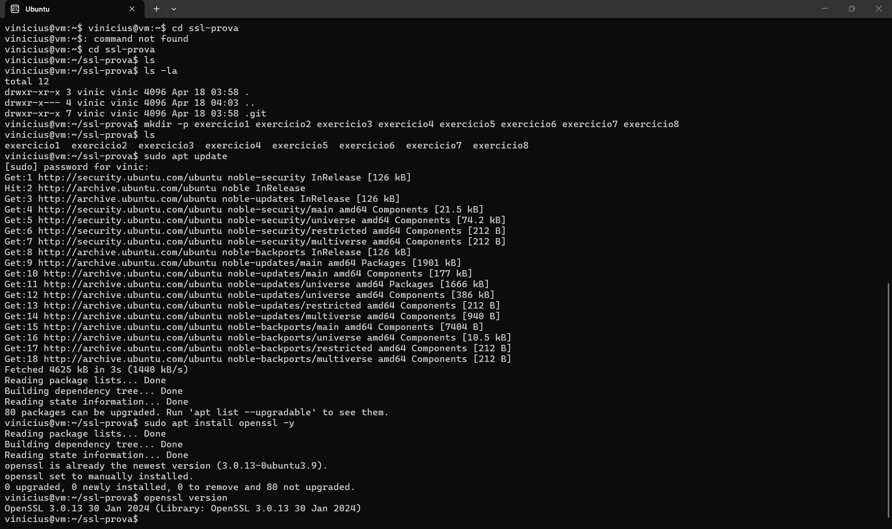

# Exercício 1 — Preparação do Ambiente

## Comandos
```bash
sudo apt update
sudo apt install openssl -y
openssl version
```

## Resultado
OpenSSL 3.0.13 30 Jan 2024

## O que é o OpenSSL

OpenSSL é uma biblioteca open source que implementa os protocolos SSL/TLS e fornece um conjunto de ferramentas criptográficas. Com ela é possível gerar chaves, criar CSRs, emitir e assinar certificados X.509, calcular hashes e testar conexões TLS. É a ferramenta padrão usada para lidar com HTTPS no Linux.

## Evidência

