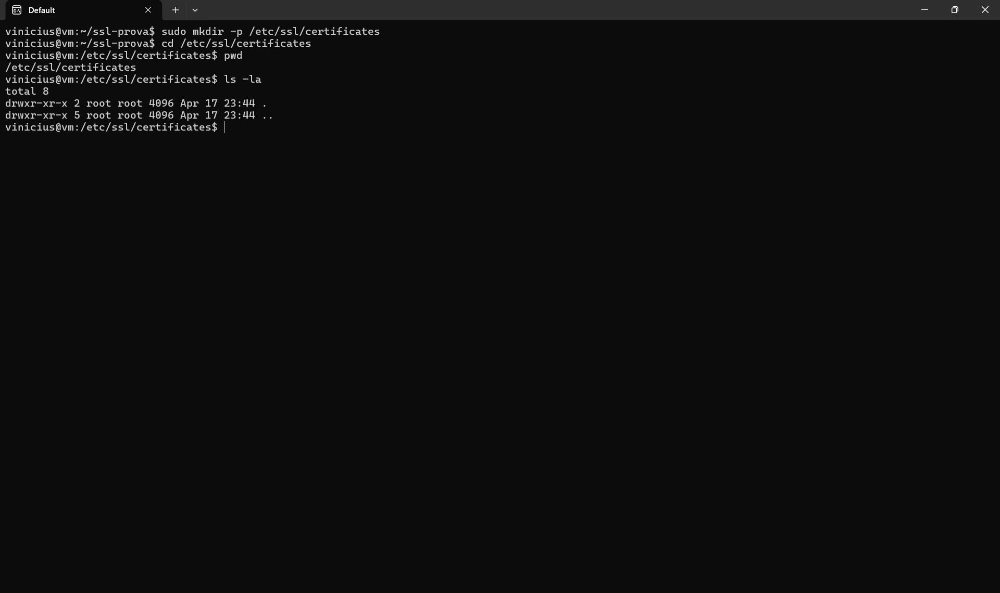

# Exercício 2 — Estrutura de Diretórios

## Comandos
```bash
sudo mkdir -p /etc/ssl/certificates
cd /etc/ssl/certificates
```

## Explicação

O diretório `/etc/ssl/` é o local convencional no Linux para armazenar material criptográfico relacionado a SSL/TLS, seguindo o FHS (Filesystem Hierarchy Standard). Criamos o subdiretório `certificates/` para isolar os artefatos da prática (chave privada, CSR e certificado).

- `mkdir -p` cria o diretório e os pais necessários sem erro se já existir.
- Usar `/etc/ssl/` segue a convenção do sistema e é onde servidores web (nginx, apache) buscam certificados por padrão.
- Permissões restritas são importantes para proteger a chave privada.

## Evidência

