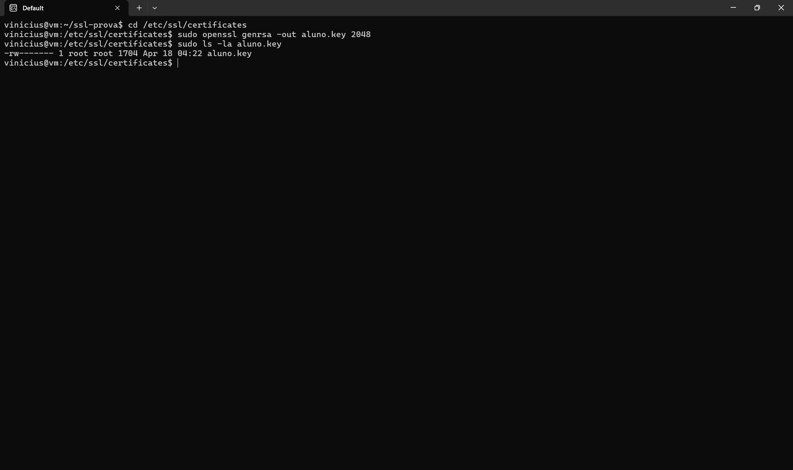

# Exercício 3 — Geração da Chave Privada

## Comando
```bash
openssl genrsa -out aluno.key 2048
```

## O que é uma chave privada

A chave privada é a metade secreta de um par de chaves assimétricas (RSA). Ela é usada para:

- **Assinar digitalmente** requisições (CSR) e outros dados, provando identidade.
- **Decifrar** mensagens cifradas com a chave pública correspondente.
- **Estabelecer sessões TLS**: no handshake HTTPS, o servidor usa a chave privada para provar que é o dono legítimo do certificado.

### Parâmetros
- `genrsa`: gera par de chaves RSA.
- `-out aluno.key`: arquivo de saída.
- `2048`: tamanho da chave em bits (mínimo considerado seguro hoje; 4096 é recomendado para longo prazo).

### Segurança
A chave privada **nunca** deve ser compartilhada, enviada por email ou commitada em repositórios públicos. Se vazar, é preciso revogar o certificado imediatamente.

## Evidência

