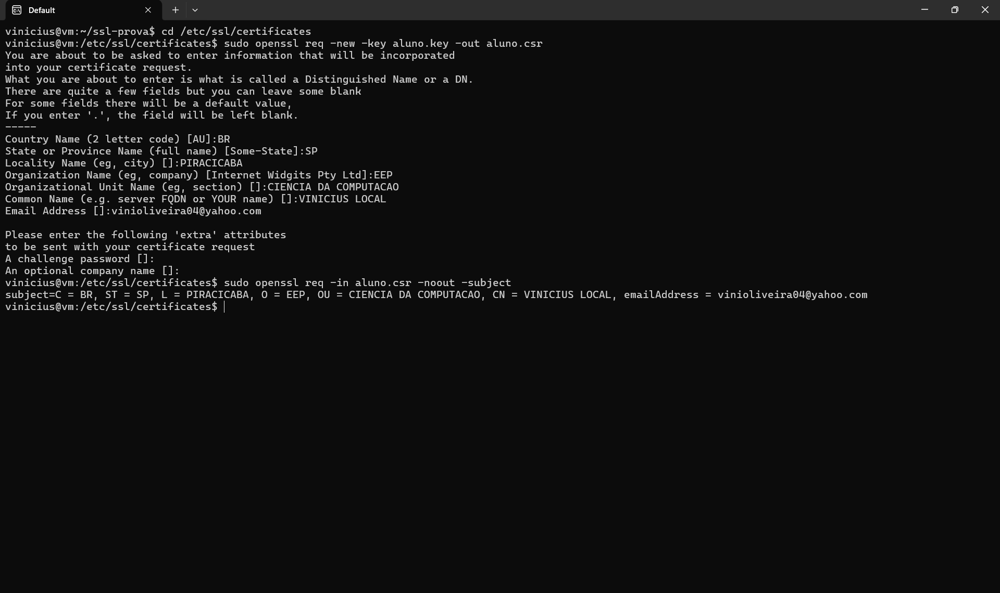

# Exercício 4 — Geração do CSR

## Comando
```bash
openssl req -new -key aluno.key -out aluno.csr
```

## O que é um CSR

CSR significa **Certificate Signing Request** — requisição de assinatura de certificado. É o documento enviado a uma Autoridade Certificadora (CA) pedindo a emissão de um certificado digital.

O CSR contém:
- A **chave pública** correspondente à chave privada gerada anteriormente.
- Os **dados de identificação** do solicitante (Subject): país, estado, cidade, organização, CN (Common Name) e email.
- Uma **assinatura digital** feita com a chave privada, provando posse da chave correspondente.

### Fluxo real
Em produção, o CSR seria enviado a uma CA pública (Let's Encrypt, DigiCert), que verificaria a identidade e devolveria o certificado assinado. Nesta prática, nós mesmos vamos assinar o CSR no próximo exercício (self-signed).

### Common Name (CN)
O CN deve ser o FQDN do servidor que usará o certificado. Se não bater com o domínio acessado, o navegador recusa a conexão.

## Evidência

