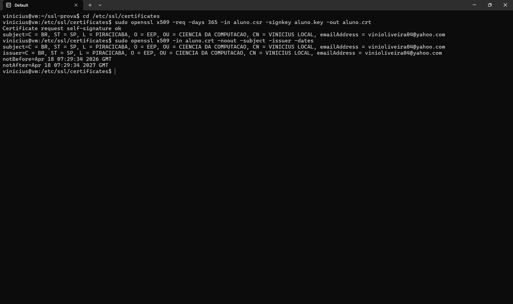

# Exercício 5 — Certificado Autoassinado

## Comando
```bash
openssl x509 -req -days 365 -in aluno.csr -signkey aluno.key -out aluno.crt
```

## Explicação

Este comando gera um **certificado X.509 autoassinado** (self-signed). Normalmente o CSR é assinado por uma CA externa, mas aqui a mesma chave privada que gerou o CSR também o assina — por isso o Issuer é igual ao Subject.

### Parâmetros
- `x509`: manipula certificados X.509.
- `-req`: indica que a entrada é um CSR.
- `-days 365`: validade de 1 ano.
- `-in aluno.csr`: CSR de entrada.
- `-signkey aluno.key`: assina com a chave privada (autoassinatura).
- `-out aluno.crt`: arquivo de saída no formato PEM.

### Conteúdo de um certificado X.509
- Versão (v3)
- Número de série
- Algoritmo de assinatura (SHA256withRSA)
- Issuer (emissor)
- Validade (Not Before / Not After)
- Subject (titular)
- Chave pública do Subject
- Assinatura digital do Issuer

### Limitação
Navegadores não confiam em certificados autoassinados porque o Issuer não está em nenhuma cadeia de confiança conhecida. Por isso o Exercício 7 dará aviso de certificado — é o comportamento esperado.

## Evidência

