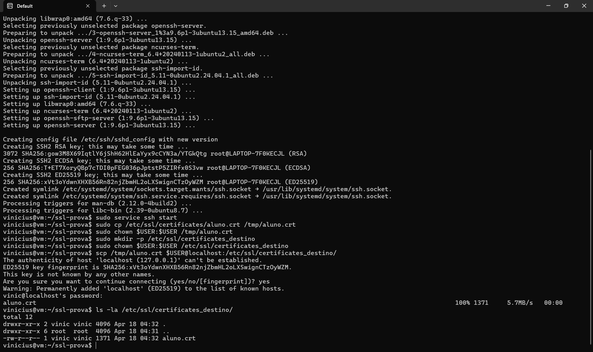

cat > README.md <<'EOF'
# Exercício 6 — Transferência Segura com SCP

## Comando
```bash
scp aluno.crt usuario@IP_DESTINO:/etc/ssl/certificates/
```

Como disponho de apenas uma máquina (WSL Ubuntu), usei `localhost` como destino após iniciar o serviço SSH local, simulando uma transferência entre máquinas.

## O que é o SCP

SCP (Secure Copy Protocol) é um utilitário para transferir arquivos entre hosts usando SSH como canal. Ele oferece:

- **Confidencialidade**: todo o tráfego é cifrado pelo SSH.
- **Integridade**: o SSH detecta alterações em trânsito.
- **Autenticação**: cliente e servidor se autenticam (por senha ou chave SSH).

### Sintaxe
scp [origem] [usuario]@[host]:[destino]

### Por que transferir só o .crt e não o .key?
O certificado (`.crt`) é público por natureza — ele é entregue a qualquer cliente que se conecte ao servidor. Já a chave privada (`.key`) **nunca** deve sair da máquina onde foi gerada.

### Alternativa moderna
O `scp` está sendo gradualmente substituído por `sftp` e `rsync -e ssh`, que usam o mesmo canal seguro com mais recursos.

## Evidência

EOF
