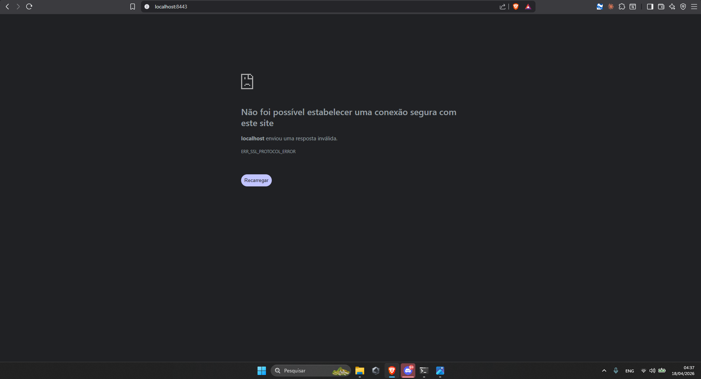

# Exercício 7 — Servidor HTTPS

## Comando do enunciado
```bash
python3 -m http.server 8443 --bind 0.0.0.0
```

## Explicação do erro

O comando acima sobe um servidor **HTTP** (sem TLS) na porta 8443. Ao acessar `https://localhost:8443`, o navegador tenta iniciar handshake TLS, mas o servidor responde em HTTP puro. Resultado:

- Chrome: `ERR_SSL_PROTOCOL_ERROR`
- Firefox: `SSL_ERROR_RX_RECORD_TOO_LONG`

Ou seja, a porta 8443 é só convenção para HTTPS — não basta trocar a porta, o servidor precisa implementar TLS. O módulo `http.server` do Python não faz isso sozinho; é preciso envolver o socket com `ssl.SSLContext` carregando chave e certificado.



## Solução: servidor HTTPS real

Script Python carregando `aluno.key` e `aluno.crt`:

```python
import http.server, ssl
server = http.server.HTTPServer(('0.0.0.0', 8443), http.server.SimpleHTTPRequestHandler)
ctx = ssl.SSLContext(ssl.PROTOCOL_TLS_SERVER)
ctx.load_cert_chain('aluno.crt', 'aluno.key')
server.socket = ctx.wrap_socket(server.socket, server_side=True)
server.serve_forever()
```

Agora o navegador completa o handshake TLS, mas avisa que o certificado não é confiável — esperado para autoassinado.


