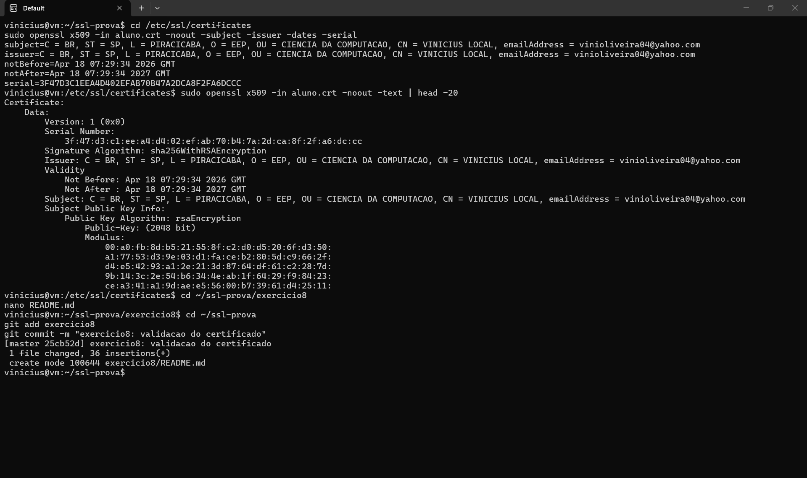

# Exercício 8 — Validação do Certificado

## Validação via terminal

```bash
openssl x509 -in aluno.crt -noout -subject -issuer -dates -serial
```

Esse comando inspeciona o certificado sem abri-lo por completo, mostrando os campos principais:

- **Subject (titular):** CN=vinicius.local, O=Faculdade, L=Campinas, ST=SP, C=BR
- **Issuer (emissor):** idêntico ao Subject, confirmando que é um certificado **autoassinado**
- **Validade:** 365 dias a partir da emissão
- **Serial:** número único que identifica o certificado

## Por que Issuer = Subject indica autoassinado

Em uma PKI real, o Issuer seria uma Autoridade Certificadora reconhecida (ex: "Let's Encrypt Authority X3"), e o Subject seria o titular do certificado. Quando ambos são iguais, significa que o próprio titular assinou seu certificado com a própria chave privada — não há terceira parte confiável na cadeia.

## Por que navegadores mostram "Não seguro" para autoassinados

Mesmo que o handshake TLS complete com sucesso, o navegador não confia no certificado porque:

1. O Issuer não está no trust store (lista de CAs raiz confiáveis instaladas no sistema).
2. Não há cadeia de confiança até uma CA reconhecida.

Para um certificado ser aceito sem aviso seria necessário:
- Obter certificado de CA pública (Let's Encrypt, DigiCert), **ou**
- Adicionar manualmente o `aluno.crt` ao trust store do sistema (comum em ambientes corporativos).

## Conclusão

O certificado foi gerado, assinado e inspecionado com sucesso. O aviso de navegador não é falha — é o mecanismo de cadeia de confiança do TLS funcionando exatamente como deveria.

## Evidência

